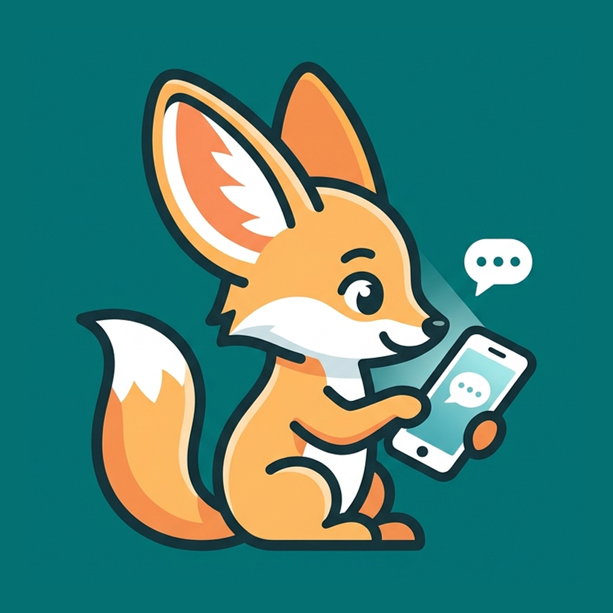
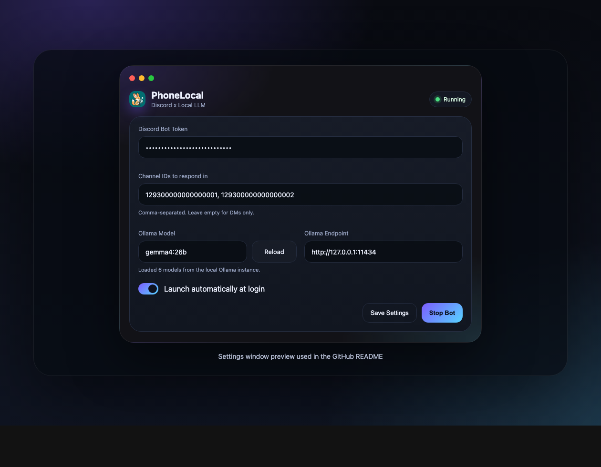
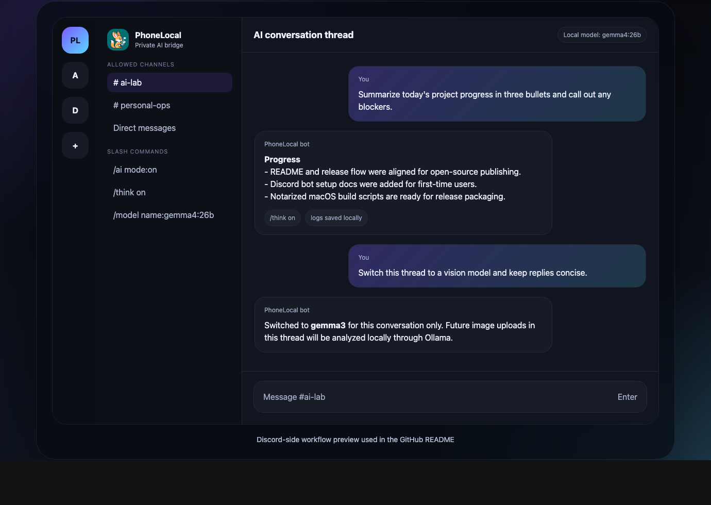

<div align="center">
  
  <p><strong>Use a powerful local LLM from your phone.</strong></p>
  <p>Keep the Mac app running and talk to any Ollama model from Discord on your PC or phone.</p>
  <p>
    
    
    
    
  </p>
</div>

## Overview

PhoneLocal is a macOS menu bar app for running Ollama through Discord.
Start the app on your Mac, pick a model, and chat from Discord anywhere.

## Screenshots

<table>
  <tr>
    <td width="50%">
      
    </td>
    <td width="50%">
      
    </td>
  </tr>
  <tr>
    <td align="center"><strong>Menu bar settings</strong></td>
    <td align="center"><strong>Discord chat flow</strong></td>
  </tr>
</table>

## Requirements

- macOS
- Node.js `20+`
- [pnpm](https://pnpm.io/installation)
- [Ollama](https://ollama.com)
- A Discord bot token

## Quick start

```bash
git clone https://github.com/iritec/phone-local.git phone-local
cd phone-local
pnpm install
brew install ollama
ollama serve
ollama pull gemma4:26b
pnpm start
```

Then:

1. Open the settings window from the menu bar and add your Discord bot token and Ollama settings.
2. Invite the bot to your server or use DMs.
3. Start the bot from the app.

## Discord bot setup

PhoneLocal expects a standard Discord bot application with message content access and slash commands enabled.

1. Open the [Discord Developer Portal](https://discord.com/developers/applications).
2. Create a new application and add a bot user.
3. Enable **Message Content Intent** in the bot settings.
4. Generate an OAuth URL with `bot` and `applications.commands`.
5. Invite the bot to your server.
6. Copy your user ID and place it in `ALLOWED_USER_IDS` for personal-only access.

The full step-by-step guide is in [docs/discord-bot-setup.md](docs/discord-bot-setup.md).

## Commands

- `!reset` clears the current conversation history
- `!model <name>` switches the model for the current conversation
- `!help` prints inline usage
- `/think on|off|status` toggles the model thinking mode
- `/model` shows or changes the active Ollama model for the current conversation

## License

[MIT](LICENSE)
